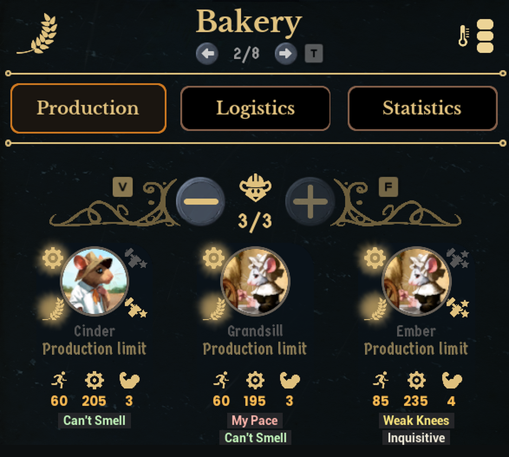

# TraitPeek

A quality-of-life mod for [Whiskerwood](https://store.steampowered.com/app/2489330/Whiskerwood/).



Whiskers' traits (Swift, Unsafe worker, Gifted Teacher…) decide who is good at which job, but the building window only shows portraits. TraitPeek puts each worker's traits as small tags right under their portrait, so you don't have to open the whisker list.

## Features

- **Tags under each portrait**, matched to the right whisker (also when two workers share a name), in every building with worker slots (production, harvesting, farms, services…).
- **Colour-coded for the building you're looking at**: green = good here, yellow = so-so, red = bad here, beige = doesn't matter. Weak Knees is yellow in a Bakery but red in a mine; Can't Smell is green wherever the recipe burns fuel.
- **Your own rules**: change any colour, per building or per group of buildings, in a small text file that mod updates never overwrite (see [Configuration](#configuration)).
- **Trait names in the game's language**, taken from the game's own text (`trait.<id>` keys); the two traits whose id differs from their text key (`pessimest`, `unsafeworker`) are mapped to `trait.pessimist` / `trait.unsafe`.
- **Stays out of the way**: hidden while the whisker picker is open, gone when the building window closes, doesn't block clicks.
- **Instant and event-driven**: updates right when you open a building window or click something in it, also while paused; nothing runs while you're not interacting.

## Configuration

The built-in rules are in [`docs/TraitPeek-defaults.txt`](docs/TraitPeek-defaults.txt), which also lists **every trait id and building id** with its in-game name. To change them, create

`%localappdata%\Whiskerwood\Saved\mods\TraitPeekConfig\TraitPeek.txt`

The file must end in **`.txt`** (the game only reads `.txt` files from the mods folder; a `TraitPeek.ini` is ignored). Watch out for Windows hiding extensions: `TraitPeek.txt.txt` won't be found either. The content is INI style. This file only **adds to** the built-in rules: anything you don't mention stays as it is. The folder is separate from the mod's own folder, so updates never touch it.

```ini
; Lines apply top to bottom; for each trait the last matching line wins.
; Your file is read after the built-in rules, so your lines beat the defaults.
[groups]
factory  = DefensiveTower              ; add a building to an existing group
kitchens = Bakery, stewery, fineKitchen ; or make your own group

[bakery]                                ; a building id
green   = swift
neutral = rebellious                    ; neutral = remove any colour

[kitchens]                              ; a group
red = sickly

[all]                                   ; every building
yellow = loner
```

- **Sections** are targets: `all`, `fuel` (the building's current recipe burns fuel / pollutes, or it's in the `fuel` group), `nofuel`, a group name, or a building id. `[groups]` is special: `name = building, building, …` (repeating a name adds to the group).
- **Keys** are `green`, `yellow`, `red` or `neutral`; values are trait ids, comma-separated. Upper/lower case and spaces don't matter; `;` and `#` start comments.
- **Building ids** are the game's internal names, mostly the English name without spaces. The less obvious ones: `Brickmaker` = Stone Cutter, `Toolmaker` = Coppersmith, `lumbermill` = Sawmill, `fishery` = Smokery, `OreSmelter` = Ore Furnace, `Teaprocessor` = Tea Roaster, `GiantShipyard` = Royal Shipyard, `Gatherer` = Forage Hut, `FoodVending` = Cafe, `fancyVending` = Dining Hall, `Supplier` = Luxuries Supplier, `CoordinationOffice` = Management Office, `TriageBeds` = Medical Triage, `researchBuilding` = Research Lab, `navaldock_scout` / `_fishing` / `_guano` / `_trade` / `_war` / `_hunting` = the naval docks. With [debug logging](#debug-logging) on, the log prints the id of every building window you open.
- **Trait ids**: swift, slow, strongShoulders, weak, weakknees, diligent, mypace, perfectionist, unsafeworker, teacher, inquisitive, heavyEater, healthy, sickly, warmCore, nosmell, optimist, pessimist, thoughtful, content, greedy, patient, compassionate, snorer, loner, rude, considerate, nosey, rebellious, monarchist (also mascochist, scientist, lightEater, which the game doesn't use).

## Installing

- **Manually:** put `TraitPeek.pak` and `TraitPeek.uplugin` in
  `%localappdata%\Whiskerwood\Saved\mods\TraitPeek\` (create the folder; file names must stay `TraitPeek.*`).

## Repository layout

| Path | What |
|---|---|
| `Mod/TraitPeek/` | The mod's source assets (`.uasset`) and `TraitPeek.uplugin`. This is the whole mod. |
| `docs/graphs/` | Blueprint graphs as copy-paste text (T3D). Reference only: the `.uasset` files are the source of truth and contain small hand edits (see below). |
| `tools/` | `t3d.py` + `traitpeek_build.py`: Python generator that writes the graphs in `docs/graphs/` from the modkit's reflection dump. `traitpeek_rules.py` holds the built-in rules; `rules_sim.py` runs the same rule logic in Python for checking. |
| `docs/TraitPeek-defaults.txt` | The built-in colour rules in readable form (the same text is built into `WBP_TraitPeek`). |
| `docs/screenshot.png` | Screenshot, also used as the Workshop preview image. |
| `workshop/` | SteamCMD item file (`TraitPeek.vdf`) and [upload steps](workshop/HOW_TO_UPLOAD.md). |

## Building from source

1. Set up the official [Whiskerwood modkit](https://github.com/Whiskerwood-Modding/Whiskerwood-Project) (custom **UE 5.8** build, see its README). Whiskerwood moved from UE 5.6 to 5.8 in October 2026; a pak cooked with the old 5.6 modkit is built for the old engine, so use the 5.8 modkit.
2. Copy `Mod/TraitPeek/` from this repo to `Content/Mods/TraitPeek/` in the modkit project.
3. Open the project, right-click the `TraitPeek` folder → **Cook & Install** (Mod Tools).
4. After editing in the editor, copy the changed `.uasset` files from the modkit back into `Mod/TraitPeek/`, then commit.

### Regenerating a graph

`python tools/traitpeek_build.py` writes fresh paste text into `tools/out/` (needs the modkit's `Content/DynamicClasses/Whiskerwood-*.jmap.gz`; set `JMAP=...` if it isn't next to this repo). In the asset's graph: Ctrl+A, Delete, Ctrl+V, compile. Hand edits that the generator doesn't reproduce:

- `WBP_TraitChip` designer: `ChipBorder` brush colour `#242528` (the game's trait-tag grey), padding 6/2.
- `WBP_TraitLayer` designer: a single **Canvas Panel** named `Root` (**Is Variable** on), Visibility **Not Hit-Testable (Self Only)**. No graph.
- If a **Cast To …** node's blue output pin pastes unconnected, drag it to the node it feeds (Get Text / m_isAgentSelectOpen).
- Paste and compile `WBP_TraitColumn` **before** `WBP_TraitPeek` (its `SetData` event's inputs must exist first).

Variables (exact names and types):

| Blueprint | Variable | Type |
|---|---|---|
| `BP_MapLoad` | `Debug` | Boolean |
| | `Peek` | User Widget (object reference) |
| `WBP_TraitPeek` | `Debug`, `Bound` | Boolean |
| | `Waited` | Float |
| | `LayerRoot` | Canvas Panel (object reference) |
| | `Anchor` | Widget (object reference) |
| | `Building` | Actor (object reference) |
| | `Workers` | Prototype Agent (object reference) **array** |
| | `Slots` | Worker Slot (structure) **array** |
| | `Key`, `LastKey`, `Dbg`, `LastDbg`, `Source` | String |
| | `ColNames`, `PassNames` | String **array** |
| | `Columns` | WBP_TraitColumn (object reference) **array** |
| | `RulesLoaded`, `Fuel` | Boolean |
| | `RulesText`, `Section`, `Line`, `BuildingId`, `Targets`, `Green`, `Yellow`, `Red`, `Trait` | String |
| | `Lines`, `Parts`, `GroupNames`, `GroupMembers`, `RuleTargets`, `RuleColours`, `RuleTraits` | String **array** |

## How it works

| Asset | Role |
|---|---|
| `BP_MapLoad` | When a save has loaded (`onLoadingFinished`): reads `TraitPeekConfig\debug.txt`, creates `WBP_TraitLayer` (always in the viewport, holds the tag columns) and `WBP_TraitPeek`, hands it the layer's canvas and the Debug flag, and enables input. Any key or mouse button released in the world (`Any Key` input event, not consumed, works while paused) "kicks" `WBP_TraitPeek`. |
| `WBP_TraitLayer` | Full-screen, click-through canvas the columns live on. No logic, never ticks anything. |
| `WBP_TraitPeek` | The worker. A kick adds it to the viewport (or restarts its window if it's already there); while it is in the viewport its Tick refreshes every frame, and 0.4 s after the last kick it removes itself, so nothing runs between interactions. It binds the open window's own buttons (prev/next building, +/-, slots, picker, close) to the same kick, because clicks on game UI don't reach input events. A refresh finds the open building window (a visible `ArcoView` whose `Context` is a `GridActor`), reads the workers in slot order from the building's worker component (`Industry`, `FarmBuilding`, `HarvestingCamp`, … `.m_workers.m_workerSlots[].Agent`; unknown building types fall back to whiskers whose `GetWorkplace()` is the building), and rebuilds one `WBP_TraitColumn` per worker when the list or the building's recipe changes. Before rebuilding it works out the colours for this building: on first use it parses the built-in rules plus `TraitPeekConfig\TraitPeek.txt` (INI-style lines into group and rule lists), then collects the building's targets (`all`, its id, every group it is in, and `fuel` if the `Industry` component's current recipe has `pollutionPerSecond > 0` or it is in the `fuel` group, else `nofuel`) and applies every matching rule in file order into green / yellow / red trait lists. It then finds the portraits' name labels (`TextBlock`s named `string_name`) with `NaviUi.FindDecendentsOfClasses`; each label claims the first unused column whose `agentName` matches, so two whiskers with the same name each get their own tags, and the column goes 88 units under the label. While the whisker picker is open (`WorkerAssignmentPanel.m_isAgentSelectOpen`) the columns are hidden and the refresh keeps running until it closes. |
| `WBP_TraitColumn` | One worker's tags: reads `m_characteristics.traits`, looks up the display name via `LocManager.GetWordFromKey("trait.<id>")`, picks the colour from the green / yellow / red lists it was given, and adds a `WBP_TraitChip` per trait to a wrap box. |
| `WBP_TraitChip` | A single tag: grey border + text, text tinted with the trait's colour. |
| `PAL_TraitPeek` | Primary Asset Label that puts the mod into its own pak chunk. |

A trait added in a later game version shows in the neutral colour until a rule mentions it, and with its raw id if it has no `trait.<id>` text.

## Known limitations

- The vertical offset (88 units under the name label) was tuned by eye; if a game update changes the portrait card layout, the tags may overlap the stats row.
- If a worker is assigned or leaves on its own (not through a click) while the window stays open, the tags update on your next click or key press.
- Two workers with the same name are told apart by slot order; the game's portrait order is assumed to match its slot list.
- Rules apply to building types, not to one particular building (all your Bakeries share the same colours).

## Debug logging

Published builds log nothing. To see what the mod does, create `%localappdata%\Whiskerwood\Saved\mods\TraitPeekConfig\debug.txt` with any text in it (an empty file counts as off) and load a save. `modlog.txt` then gets a "ready" line, one line with how many rules were loaded (and how long your `TraitPeek.txt` was), and for each building window the building id, its targets and colour lists (`TraitPeek colours <id> [<targets>] green… yellow… red…`) plus the matched names (`TraitPeek: <building> via <worker component>: <label>=<column> …`).

## Version history

- **1.2** — The config files now actually load: your rules go in `TraitPeekConfig\TraitPeek.txt` and the debug switch is `TraitPeekConfig\debug.txt`. The game's `ReadModTextFile` always adds `.txt` to the name, so the `.ini` files of 1.1 were never read. If you made a `TraitPeek.ini`, rename it to `TraitPeek.txt`.
- **1.1** — Trait colours now depend on the building: green / yellow / red / neutral rules per building and group (factories, extraction, services, school, research, fishing, docks), Can't Smell green and Sickly red depending on whether the recipe burns fuel. Your own rules in `TraitPeekConfig\TraitPeek.ini`. Debug switch moved to `TraitPeekConfig\debug.ini`. Published together with the 1.0 fixes.
- **1.0** (not published separately) — Fixed missing tags when two workers in a building have the same name. Pessimist and Unsafe worker now show their proper names (they showed as `pessimest` / `unsafeworker`). Tags now appear and disappear instantly (event-driven instead of checking five times a second). No log output unless the debug file is present.
- **0.2** — Rebuilt with the UE 5.8 modkit for Whiskerwood's Unreal Engine 5.8 update. No behaviour changes.
- **0.1** — First release (UE 5.6).

## Credits

Created using the Whiskerwood modkit: https://github.com/Whiskerwood-Modding/Whiskerwood-Project
